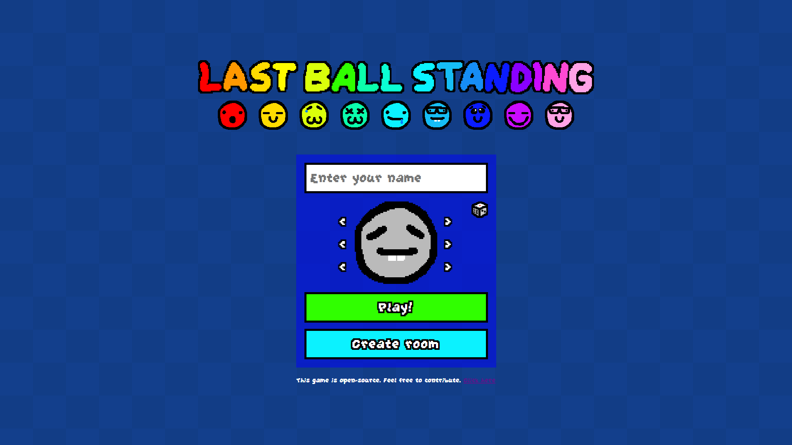
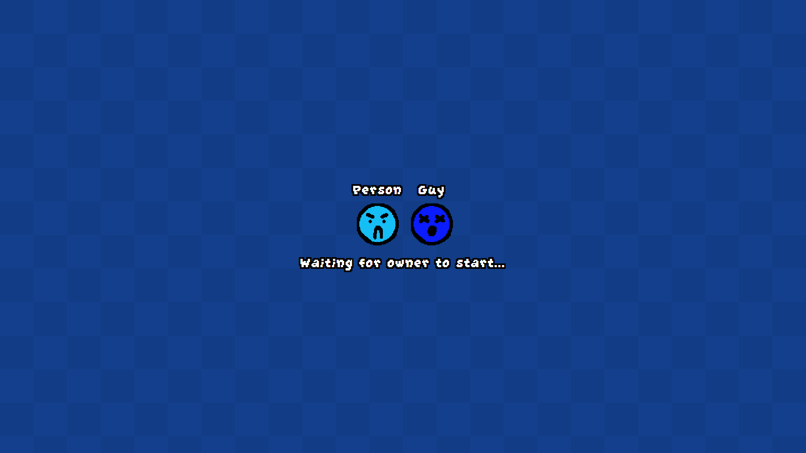
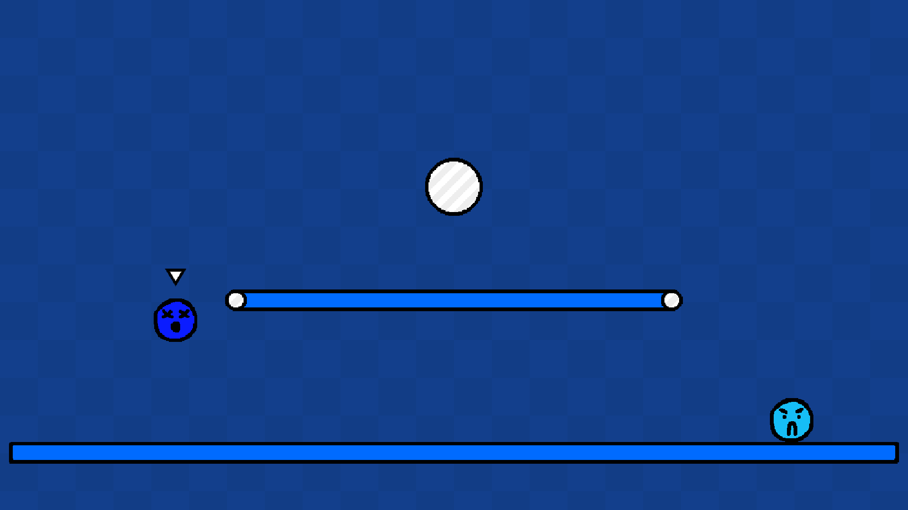
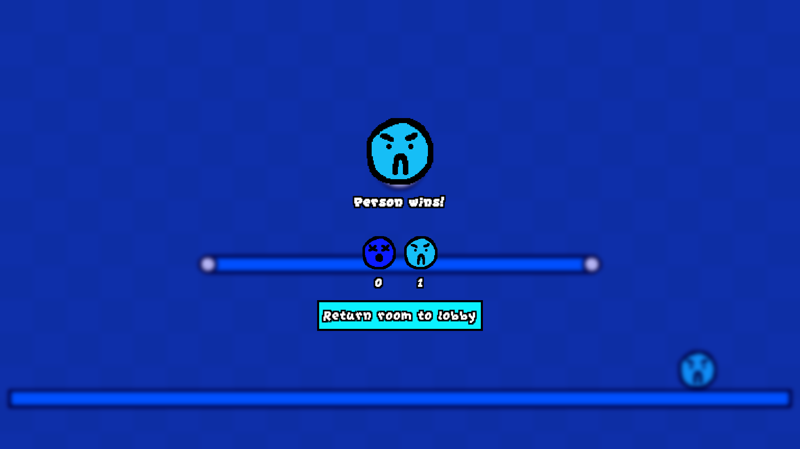
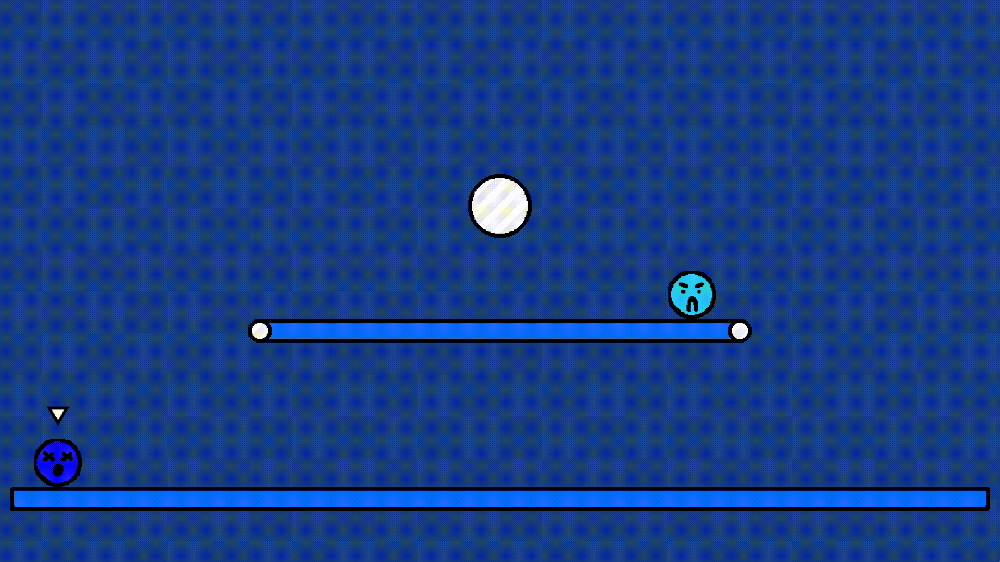

    <picture>
        
    </picture>

<h3 align="center" style="font-family: monospace;">
    Multiplayer FFA web game!
</h3>
 

## Navigation
1. [Demos](https://github.com/alyshukry/last-ball-standing#demos)
2. [Features](https://github.com/alyshukry/last-ball-standing#features)
## Features
A real-time multiplayer physics game inspired by bonk.io's gameplay and skribble.io's art style. Built solo with Node.js, Express, and WebSockets, with server-authoritative physics powered by Matter.js and a vanilla JS/Canvas frontend. Players fight across custom arenas with a sprite-based avatar system, real-time player counts via Redis, and secure socket-based auth. Deployed on Render.
## Demos
### Live Demo Link: [last-ball-standing.onrender.com/](https://last-ball-standing.onrender.com/)

